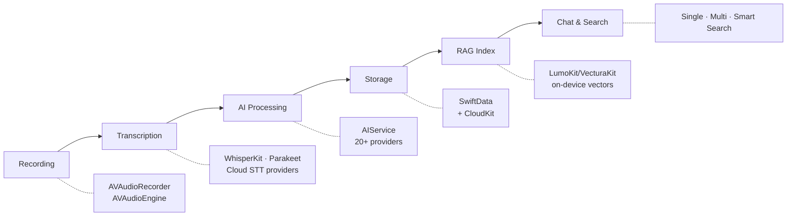
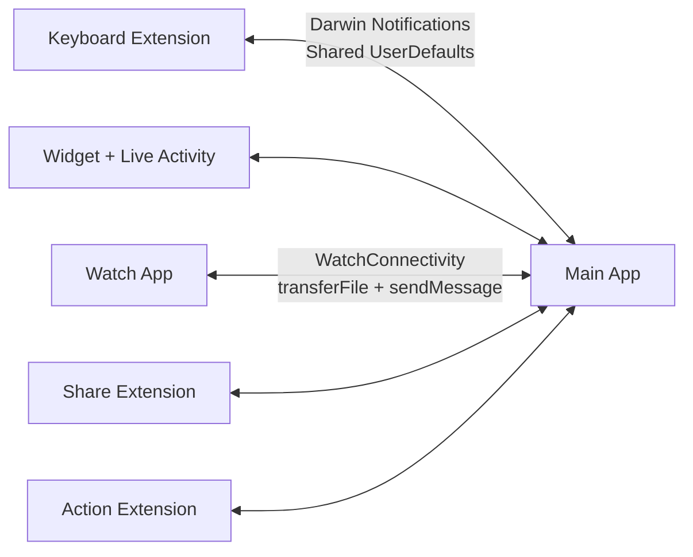
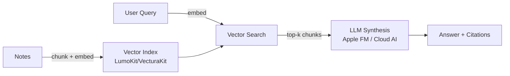

<p align="center">
  
</p>

<h1 align="center">VivaDicta</h1>

<p align="center">
  iOS & watchOS speech-to-text app with AI voice keyboard, on-device RAG, and chat with your notes - powered by Apple Foundation Models, WhisperKit, NVIDIA Parakeet, and 20+ AI providers
  <br>
  <a href="https://vivadicta.com/ios">Website</a> &bull;
  <a href="https://apps.apple.com/app/id6758147238">App Store</a> &bull;
  <a href="documentation/README.md">Documentation</a>
</p>

<p align="center">
  
  
  
  
  
</p>

---

<p align="center">
  
</p>

> Started as "I don't want to pay for WisprFlow." Ended up building something more flexible — on-device transcription, 20+ AI providers, on-device RAG with chat, OAuth sign-in, CLI agent bridge, and full control over your voice-to-text pipeline.

VivaDicta records speech, transcribes it using on-device or cloud models, and optionally processes the text through an AI provider — including Apple Foundation Models for free, fully on-device AI. Its key feature is a system-wide AI voice keyboard that lets you dictate and AI-process text directly into any app — Messages, WhatsApp, Slack, email, or anything else. The keyboard can also rewrite existing text in any app — select text, apply an AI preset, and get the result in place. Chat with your notes - ask questions about one note or many, powered by on-device RAG pipeline. Smart Search finds notes by meaning with on-device semantic search. Sign in with your ChatGPT, Gemini, or GitHub Copilot account via OAuth, or route AI through CLI agents on your Mac with VivAgents. Supports 11 transcription providers, 20+ AI providers, and syncs across devices (iOS/iPadOS/macOS/watchOS) via CloudKit.

## Screenshots

<p align="center">
  
  &nbsp;&nbsp;
  
  &nbsp;&nbsp;
</p>

<p align="center">
  
  &nbsp;&nbsp;
  
</p>

<p align="center">
  
</p>

## Features

**Transcription**
- **On-device** - WhisperKit (OpenAI Whisper), Parakeet (NVIDIA) - professional-grade models running entirely on your device
- **Cloud** - OpenAI, Groq, Cohere, Deepgram, ElevenLabs, Gemini, Mistral, Soniox, or any OpenAI-compatible endpoint
- 100+ languages with automatic detection
- **Diarization** - speaker-separated transcripts for meetings, interviews, and group conversations
- Filler word removal, paragraph formatting, custom word replacements

**AI Presets**
- 40+ built-in presets across categories: Rewrite, Style, Communication, Summarize, Social Media, Writing, Learn & Study, Translate
- **AI Assistant** - ask questions, fact-check, explain, reformat, or give instructions by voice
- **Auto-Translation** - speak in one language, get output in another
- Each result saved as a **variation** - compare different AI outputs side by side
- Create custom presets with full prompt control, mark favorites for quick access

**Chat & RAG**
- **Single-note chat** - ask questions about any transcription, extract action items, summarize
- **Multi-note chat** - select multiple notes, find common themes, compare ideas across recordings
- **Smart Search Chat** - ask a question in plain language, the AI searches your library semantically, reads relevant notes, and answers with source citations
- **Chat tools** - cross-note semantic search and web search, with results injected into LLM context as tool calls
- **Fully on-device RAG pipeline** - chunking, vector embedding, similarity search via LumoKit/VecturaKit - no server, no cloud, your data never leaves your device
- **Smart Search bar** - semantic search across all notes by meaning, not just keywords. On-device vector matching with relevance scores
- **Citation-backed answers** with tappable source references
- **Reminder Suggestions** - AI extracts actionable items from notes, review and send to Apple Reminders
- All chat modes work with **Apple Foundation Models** on-device (free, private) or any cloud AI provider

**AI Providers**
- 20+ providers: Apple Foundation Models (on-device, free), Anthropic, OpenAI, Gemini, GitHub Copilot, Groq, Mistral, Cerebras, Grok, OpenRouter, Vercel AI Gateway, HuggingFace, Ollama, and more
- **OAuth sign-in** for ChatGPT, Gemini, and GitHub Copilot - use your existing subscription, no API keys needed
- Bring your own AI via any OpenAI-compatible API endpoint

**VivAgents — CLI Agent Bridge**
- Route AI processing through CLI agents (Claude Code, Codex, Gemini CLI) running on your Mac or a remote server
- Use your existing CLI subscriptions instead of separate API keys
- Per-agent toggles, health monitoring, and automatic fallback to API keys if the server is unavailable

**VivaModes**
- Configurable profiles combining transcription provider, AI provider, model, preset, and language
- Each mode remembers its settings — switch contexts with one tap
- **Clipboard context** - AI uses copied text as context when processing your dictation (e.g., copy a message, then dictate your reply)

**Custom AI Voice Keyboard**
<p>

</p>

- **System-wide voice keyboard** - dictate into Messages, WhatsApp, Email, Notion, Slack, or any app
- Full transcription + AI processing pipeline right from the keyboard
- **AI text processing in any app** - select existing text in any app and rewrite, summarize, translate, or apply any preset without leaving it. The keyboard reads the text, sends it to the main app for AI processing via IPC, and replaces it in place
- Swipe to switch between modes without leaving the app you're typing in

**Personalization**
- Custom dictionary for names and terms (OpenClaw, Dr. Johnson, etc.)
- Word replacements and shortcuts (e.g., "my email" → support@vivadicta.com)
- Audio recordings saved alongside transcriptions

**Apple Watch App**
- Record voice notes directly on Apple Watch - audio transfers to iPhone via WatchConnectivity
- **Background transcription** - notes are processed before you open the iPhone app
- **Watch face complications** for one-tap recording
- **Control Center** button and **Action Button** support for start/stop toggle
- **Viva Mode picker** - switch modes right on the watch

**Sync & Extensions**
- iCloud sync across iPhone, iPad, and Mac — transcriptions, presets, custom dictionary, and API keys
- Home and Lock screen widgets and Control Center control to quickly record a note
- Live Activity for recording status
- Share Extension and Action Extension for importing audio files from other apps

## Key Technical Highlights

- On-device RAG pipeline - chunked vector indexing, semantic search, and LLM synthesis via LumoKit/VecturaKit
- Apple Foundation Models for free, private on-device AI processing
- On-device STT via WhisperKit and NVIDIA Parakeet (CoreML / Apple Neural Engine)
- Swift 6 with strict concurrency
- Modular Swift Package architecture - layered, dependency-inverted modules with protocol-based DI
- SwiftUI + Liquid Glass
- SwiftData with CloudKit sync
- watchOS companion app with WatchConnectivity file transfer and background transcription
- Cross-process IPC using Darwin Notifications between 6 targets
- 7-stage text processing pipeline with customizable transforms
- App Intents — Siri and Shortcuts integration
- CoreSpotlight — indexed transcriptions for iOS spotlight search
- OAuth for ChatGPT, Gemini, and GitHub Copilot
- VivAgents client for routing AI through CLI agents on Mac/remote server
- iCloud Keychain for secure cross-device API key sync

## Build a Development IPA

The reproducible archive/export entry point is `scripts/build-ipa.sh`. Run it on macOS with an Xcode version whose installed iOS SDK supports the target device OS:

```bash
ALLOW_PROVISIONING_UPDATES=1 bash scripts/build-ipa.sh
```

The script resolves Swift packages, archives the `VivaDicta` scheme, and exports a development-signed IPA under `build/ipa-<timestamp>/`. Sign in to the Apple Developer account in Xcode and enable the target device for development signing before running it. If provisioning profiles are already installed, `bash scripts/build-ipa.sh` is sufficient.

## Architecture



### Module structure

The app composes a ring of local Swift Package modules (`Modules/`) under layered, dependency-inverted boundaries: dependencies point inward, consumers depend on protocols (`any NetworkService`, `any AITextProvider`, …), and the app target is the composition root that wires the `Default*` implementations. The transcription stack (`TranscriptionCore` / `CloudTranscription` / `LocalTranscription` / `TranscriptionKit`) and the AI stack (`AICore` / `AIProviders` / `AIKit`) are two instances of the same shape.

Solid arrow = production code dependency. `<Module>Mocks` targets always depend on their own `<Module>` + `TestUtilities` and are omitted for clarity.

<picture>
  <source media="(prefers-color-scheme: dark)" srcset="documentation/assets/module-graph-dark.svg">
  
</picture>

*Collapsed view: 21 packages drawn as 9 nodes. `Core leaves ×7` = `Keychain` · `Presets` · `AudioRecording` · `Analytics` · `TextProcessing` · `AppGroup` · `DesignSystem`; `Transcription ×2` = `CloudTranscription` · `LocalTranscription`; `AI adapters ×3` = `AIProviders` · `LocalLLM` · `OAuth`. The app target also depends directly on every core package (composition root). Not drawn: `OAuth → Keychain`, `AIKit → Keychain`, `TranscriptionKit → Networking`, `AIKit → Networking`, and the external `WhisperKit / FluidAudio` and `LiteRT-LM` SDKs. Badges count dependents in the full graph.*

```mermaid
graph BT
  classDef core fill:#0e2a16,stroke:#7ee787,color:#7ee787
  classDef adapter fill:#332306,stroke:#ffa657,color:#ffa657
  classDef orchestrator fill:#3b0e26,stroke:#f778ba,color:#f778ba
  classDef app fill:#3b0d0d,stroke:#ff7b72,color:#ff7b72
  classDef external fill:#1c2128,stroke:#8b949e,color:#8b949e

  %% Core
  Networking[Networking]:::core
  Keychain[Keychain]:::core
  Presets[Presets]:::core
  TranscriptionCore[TranscriptionCore]:::core
  AICore[AICore]:::core
  AudioRecording[AudioRecording]:::core
  Analytics[Analytics]:::core
  TextProcessing[TextProcessing]:::core
  AppGroup[AppGroup]:::core
  DesignSystem[DesignSystem]:::core
  TestUtilities[TestUtilities]:::core

  %% Adapters
  OAuth[OAuth]:::adapter
  CloudTranscription[CloudTranscription]:::adapter
  LocalTranscription[LocalTranscription]:::adapter
  AIProviders[AIProviders]:::adapter
  LocalLLM[LocalLLM]:::adapter

  %% Orchestrators
  TranscriptionKit[TranscriptionKit]:::orchestrator
  AIKit[AIKit]:::orchestrator

  %% App
  VivaDicta[VivaDicta app + extensions]:::app

  %% External
  WhisperKit[WhisperKit / FluidAudio]:::external
  LiteRT[LiteRT-LM / LiteRTFoundation]:::external

  OAuth --> Keychain
  OAuth --> Networking
  CloudTranscription --> TranscriptionCore
  CloudTranscription --> Networking
  LocalTranscription --> TranscriptionCore
  LocalTranscription --> WhisperKit
  AIProviders --> AICore
  AIProviders --> Networking
  LocalLLM --> AICore
  LocalLLM --> LiteRT

  TranscriptionKit --> TranscriptionCore
  TranscriptionKit --> CloudTranscription
  TranscriptionKit --> LocalTranscription
  TranscriptionKit --> Networking
  AIKit --> AICore
  AIKit --> AIProviders
  AIKit --> Keychain
  AIKit --> OAuth
  AIKit --> Networking

  VivaDicta --> TranscriptionKit
  VivaDicta --> AIKit
  VivaDicta --> CloudTranscription
  VivaDicta --> LocalTranscription
  VivaDicta --> OAuth
  VivaDicta --> AIProviders
  VivaDicta --> LocalLLM
  VivaDicta --> TranscriptionCore
  VivaDicta --> AICore
  VivaDicta --> Keychain
  VivaDicta --> Networking
  VivaDicta --> Presets
  VivaDicta --> AudioRecording
  VivaDicta --> AppGroup
  VivaDicta --> Analytics
  VivaDicta --> TextProcessing
  VivaDicta --> DesignSystem
```

<details>
<summary>Full graph (Mermaid, all 21 packages)</summary>



</details>

| Layer | Modules |
|-------|---------|
| **Core** (no module deps; protocols + value types) | `Networking` · `Keychain` · `Presets` · `TranscriptionCore` · `AICore` · `Analytics` · `TextProcessing` · `AudioRecording` · `AppGroup` · `DesignSystem` |
| **Adapters** (protocol + `Default` impl + `Mock`) | `OAuth` · `CloudTranscription` · `LocalTranscription` · `AIProviders` · `LocalLLM` |
| **Orchestrators** (compose adapters) | `TranscriptionKit` · `AIKit` |
| **App** (composition root) | `VivaDicta` + keyboard / widget / share / action / watch targets |

Full breakdown, mocks, and the AI request flow: **[Module Architecture](documentation/Module-Architecture.md)**.

Main app ↔ extensions IPC via `AppGroupCoordinator` (Darwin Notifications + Shared UserDefaults):



On-device RAG pipeline:



Core components:

| Component | Role |
|-----------|------|
| `AppGroupCoordinator` | Cross-process communication using Darwin Notifications (custom keyboard, widgets, share, action extensions) |
| `PhoneWatchConnectivityService` | WatchConnectivity file reception, mode syncing, background transcription via `WatchAudioProcessor` |
| `WatchAppCoordinator` | Darwin notifications between watch app and watch widget extension (Control Center, Action Button) |
| `RecordViewModel` | Recording lifecycle, dual audio paths (normal + keyboard prewarm) |
| `TranscriptionManager` | Routes to on-device or cloud STT, post-processing pipeline |
| `AIService` | AI text processing, 20+ providers, OAuth, VivAgents, mode/API key management |
| `PresetManager` | Built-in + custom presets, CloudKit sync |
| `RAGIndexingService` | On-device vector indexing, chunking, semantic search via LumoKit/VecturaKit |
| `SmartSearchChatViewModel` | Smart Search Chat - semantic retrieval + LLM synthesis with source citations |
| `ChatViewModel` | Single-note chat with cross-note search capability |
| `MultiNoteChatViewModel` | Multi-note chat with theme extraction and comparison |
| `AudioPrewarmManager` | Continuous audio engine for keyboard extension low-latency recording |

See the [documentation](documentation/README.md) for detailed diagrams and flows.

## Building

**Requirements:**
- Xcode 26+
- iOS 18+ / watchOS 10+ deployment targets

```bash
# Clone
git clone https://github.com/n0an/VivaDicta.git
cd VivaDicta

# Open in Xcode
open VivaDicta.xcodeproj

# Or build from command line
xcodebuild build \
  -scheme VivaDicta \
  -workspace ./VivaDicta.xcodeproj/project.xcworkspace \
  -destination generic/platform=iOS \
  CODE_SIGNING_ALLOWED=NO
```

> **Note:** On-device transcription models (WhisperKit, Parakeet) are downloaded on first use. Cloud AI providers work via API keys, OAuth sign-in (ChatGPT, Gemini, Copilot), or VivAgents server connection.

## Project Structure

```
VivaDicta/
├── VivaDicta/              # Main app target
│   ├── Views/              # SwiftUI views + view models
│   ├── Models/             # SwiftData models (Transcription, Preset, etc.)
│   ├── Services/           # Core services
│   │   ├── AIEnhance/      # AIService, prompts, VivAgents CLI bridge
│   │   ├── Analytics/      # AnalyticsService, MetricKit performance monitoring
│   │   ├── LiveTranslation/# Live translation
│   │   ├── OAuth/          # OAuth sign-in flows
│   │   ├── RAG/            # RAGIndexingService, vector search, chunking
│   │   ├── Reminders/      # AI reminder extraction
│   │   └── Transcription/  # TranscriptionManager, STT routing
│   ├── AppIntents/         # Siri / Shortcuts intents
│   ├── Shared/             # AppGroupCoordinator, shared utilities
│   └── VivaDicta.docc/     # DocC documentation catalog
├── VivaDictaKeyboard/      # Custom keyboard extension
├── VivaDictaWidget/        # Widget + Live Activity
├── ShareExtension/         # Share extension
├── ActionExtension/        # Action extension
├── VivaDictaWatch Watch App/ # watchOS companion app
├── VivaDictaWatchWidget/   # Watch complications + Control Center control
├── VivaDictaTests/         # Unit tests (Swift Testing)
├── Modules/                # Local Swift Package modules (layered, dependency-inverted)
│   ├── AICore/             # AI kernel: AITextProvider, AIProvider enum, errors, filters
│   ├── AIProviders/        # Per-LLM clients + AITextProvider wrappers
│   ├── AIKit/              # AIProviderRegistry, TextEnhancer, CLIServerEnhancer
│   ├── Networking/         # NetworkService + DefaultNetworkService
│   ├── Keychain/           # KeychainService
│   ├── OAuth/              # OAuth managers (ChatGPT / Gemini / Copilot)
│   ├── TranscriptionCore/  # TranscriptionService protocol + value types
│   ├── CloudTranscription/ # Cloud STT provider services
│   ├── LocalTranscription/ # WhisperKit / Parakeet wrappers
│   ├── TranscriptionKit/   # Cloud/local transcription routing
│   ├── AudioRecording/     # AudioRecordingService + AudioFileService
│   ├── Presets/            # Preset domain + management
│   ├── Analytics/            # AnalyticsService protocol + AnalyticsEvent + AnalyticsMocks
│   ├── TextProcessing/      # TextFormatter, TranscriptionOutputFilter, LanguageDetector (pure)
│   └── AppGroup · DesignSystem · TestUtilities
├── documentation/          # Architecture docs, references
└── .github/workflows/      # CI: build check, Claude review, GitGuardian
```

## Documentation

- **[Documentation](documentation/README.md)** - recording pipeline, transcription system, AI processing, RAG & chat, text pipeline, preset system, AppGroupCoordinator, review request architecture
- **[RAG Architecture](documentation/Smart-Search-RAG-Architecture.md)** - on-device vector indexing, semantic search, and retrieval pipeline
- **[Chat Architecture](documentation/Chat-Architecture.md)** - single-note, multi-note, Smart Search Chat, and tool system
- **[Text Processing Pipeline](documentation/Text-Processing-Pipeline-Architecture.md)** - 7-stage pipeline from raw audio to formatted text
- **[DocC Reference](https://n0an.github.io/VivaDicta/)** - generated DocC documentation
- **[Website Docs](https://vivadicta.com/ios/docs)** - user-facing guides with screenshots

## Contributing

Contributions are welcome. Please open an issue first to discuss what you'd like to change.

1. Fork the repository
2. Create your feature branch (`git checkout -b feature/my-feature`)
3. Commit your changes
4. Push to the branch (`git push origin feature/my-feature`)
5. Open a Pull Request

The CI will run a build check on your PR automatically.

## License

This project is licensed under the MIT License. See [LICENSE](LICENSE) for details.

---

https://github.com/user-attachments/assets/d22f06b3-78f6-4eaf-9026-f11c0ea7bf57

---

<p align="center">
  Made with ❤️ by Anton Novoselov
  <br><br>
  <a href="https://twitter.com/_antonnovoselov"></a>
  &nbsp;
  <a href="https://www.linkedin.com/in/anton-novoselov/"></a>
</p>
